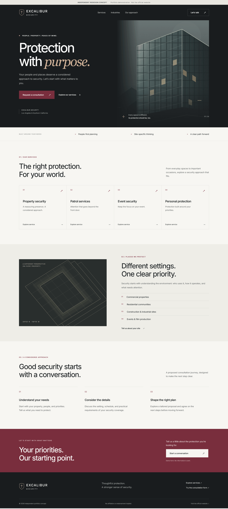
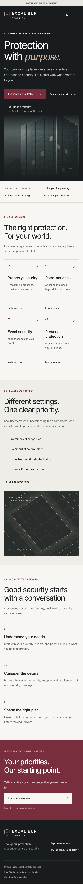
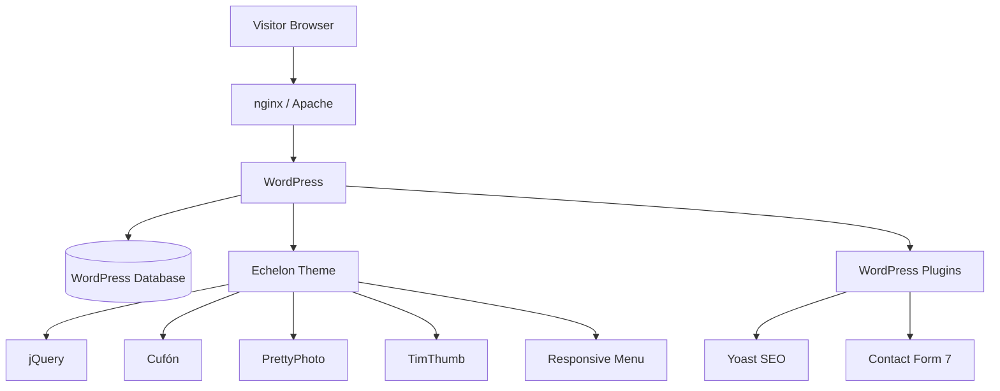
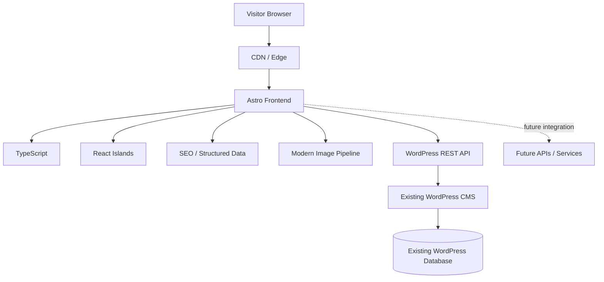
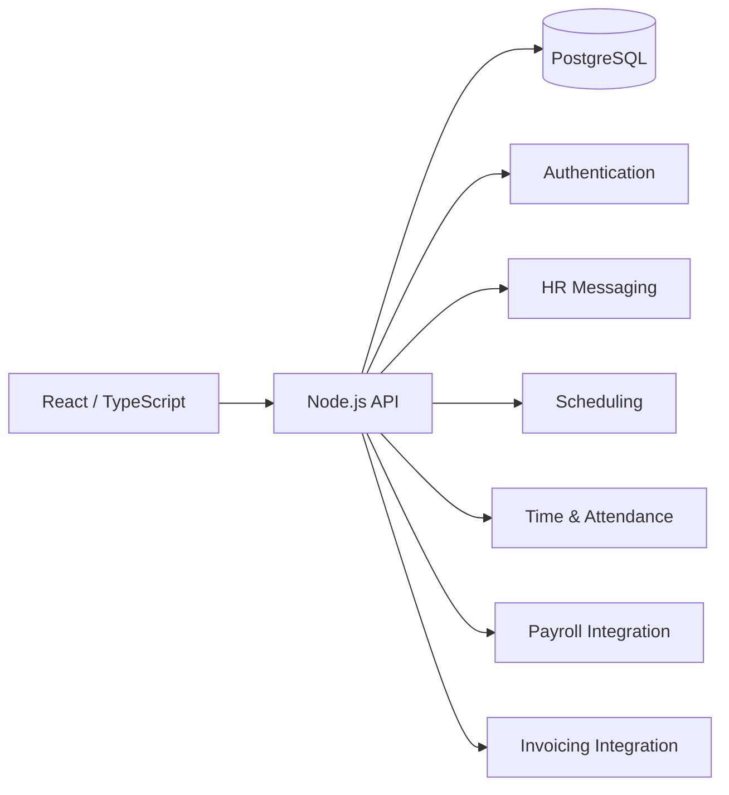

# Excalibur Security — Modernization Concept

An unofficial frontend modernization concept for **Excalibur Security, Inc.**

This project explores how the company's existing public website could be progressively modernized while preserving its current WordPress content, SEO value, and editorial workflow.

The concept focuses on a low-risk migration from a legacy WordPress presentation layer toward a modern frontend built with **Astro, TypeScript, and React**.

> **Disclaimer**
>
> This is an independent technical concept created for demonstration purposes.  
> It is not an official Excalibur Security website and is not affiliated with or operated by Excalibur Security, Inc.

---

## Preview

### Desktop



### Mobile



---

## Project Goals

The goal is not simply to redesign the website visually.

The project explores how Excalibur Security could:

- modernize its public-facing frontend;
- improve mobile usability and performance;
- reduce dependence on legacy frontend components;
- preserve existing WordPress content and editorial workflows;
- maintain or improve SEO during migration;
- introduce a modern TypeScript-based development environment;
- create a cleaner foundation for future integrations and applications;
- migrate incrementally instead of rebuilding the entire system at once.

---

## Current Architecture

A review of publicly available website resources indicates that the current Excalibur Security website uses a modern WordPress core combined with a significantly older presentation layer.

### Observed stack

- **WordPress 7.0.6**
- **Echelon WordPress theme**
- PHP-generated server-side pages
- jQuery
- jQuery Migrate
- Cufón font rendering
- PrettyPhoto
- TimThumb-based image processing
- Slick
- Responsive Menu plugin
- Contact Form 7
- Yoast SEO
- Widgets on Pages
- WordPress REST API
- XML-RPC endpoint
- nginx / Apache-based hosting infrastructure

The most important distinction is that the WordPress installation itself is relatively current, while much of the frontend architecture originates from an earlier generation of WordPress development.

Some responsive behavior also appears to have been added later through plugins rather than being part of the original theme architecture.

### Simplified current architecture



In practical terms:

```text
Browser
   ↓
nginx / Apache
   ↓
PHP / WordPress
   ↓
Echelon Theme
   ├── HTML generated by PHP
   ├── CSS
   ├── jQuery
   ├── Cufón
   ├── PrettyPhoto
   ├── TimThumb
   └── Responsive Menu
   ↓
Visitor
```

---

## Why Modernize the Frontend?

The existing website still performs its basic function, so replacing the entire platform at once would introduce unnecessary migration risk.

The larger opportunity is to separate two concerns that are currently tightly coupled:

1. **Content management**
2. **Public website rendering**

WordPress can continue performing the first function while a modern frontend performs the second.

This avoids discarding existing content and administrative workflows simply because the presentation layer has become outdated.

---

## Proposed Architecture

The proposed approach keeps WordPress initially but changes its role.

Instead of WordPress rendering the public website directly, it becomes a **headless CMS and content source**.

A new Astro application becomes the public-facing frontend.



### Proposed stack

**Frontend**

- Astro
- TypeScript
- React where interactive UI is required
- Modern CSS
- Responsive/mobile-first layout
- Static generation where appropriate
- Server rendering only where required

**Content**

- Existing WordPress installation
- WordPress REST API
- Existing posts, pages, media, and content structure

**Infrastructure**

Possible deployment targets include:

- Cloudflare Pages
- Vercel
- Netlify
- traditional Node-compatible hosting

---

## Why Astro?

The Excalibur Security public website is primarily a content and lead-generation website rather than a highly interactive application.

That makes Astro a strong architectural fit.

Astro can generate most pages as lightweight HTML while allowing React components to be introduced only where client-side interactivity is actually needed.

This provides several advantages:

- low JavaScript payload;
- fast initial page rendering;
- strong Core Web Vitals potential;
- straightforward SEO;
- excellent support for static content;
- TypeScript-first development;
- React compatibility through islands;
- simple CDN deployment;
- reduced frontend complexity.

The objective is not to replace React.

It is to use React where React provides value instead of requiring the entire website to operate as a client-side application.

---

## Progressive Migration Strategy

A complete platform replacement is not required.

The modernization can be introduced incrementally.

### Phase 1 — Prototype

Build the new frontend independently while the existing website remains untouched.

```text
Existing production website
        +
New Astro prototype
```

No production infrastructure needs to change.

---

### Phase 2 — Connect WordPress

Use the existing WordPress REST API as the content source.

```text
WordPress
   ↓
REST API
   ↓
Astro
```

Existing editors can continue managing content through WordPress.

---

### Phase 3 — Migrate Public Pages

Move public-facing pages progressively:

```text
Home
About
Services
Training
Contact
Blog
```

The old website remains available during migration.

---

### Phase 4 — Replace Legacy Theme Layer

Once the new frontend provides the required functionality:

```text
Echelon frontend
        ↓
      retired
```

WordPress may continue operating privately as the CMS.

---

### Phase 5 — Further Modernization

After the frontend is separated from WordPress, additional options become possible:

- dedicated API services;
- custom Node.js services;
- new forms and lead workflows;
- CRM integrations;
- analytics;
- employee portals;
- recruiting tools;
- authentication;
- HR application integrations;
- migration away from WordPress if that later becomes beneficial.

This decision can be made independently from the initial frontend modernization.

---

## Before / After

### Current

```text
WordPress
    │
    ├── Content
    ├── CMS
    ├── PHP rendering
    ├── Theme
    ├── Frontend JavaScript
    ├── Image processing
    └── Plugins
          ↓
       Browser
```

The CMS and presentation layer are tightly coupled.

### Proposed

```text
WordPress
    │
    │ content
    ↓
REST API
    │
    ↓
Astro + TypeScript
    │
    ├── React components
    ├── SEO
    ├── optimized assets
    ├── responsive UI
    └── integrations
          ↓
       Browser
```

Content management and frontend delivery become separate systems.

---

## Benefits of This Approach

### Lower migration risk

The existing WordPress installation does not need to be replaced immediately.

### Existing content remains usable

Pages, posts, media, and existing editorial workflows can remain in WordPress.

### Modern development environment

New frontend development moves to TypeScript and modern tooling.

### Better performance potential

Static generation and reduced JavaScript can significantly reduce frontend overhead.

### Cleaner architecture

The public website becomes independent from the implementation details of the legacy WordPress theme.

### Easier future integration

A modern frontend can communicate with WordPress, Node.js APIs, SaaS products, CRM systems, recruiting platforms, or internal applications.

### Incremental modernization

Each part can be migrated independently rather than requiring a high-risk full rewrite.

---

## Security Considerations

This project included only review of information publicly exposed by the production website.

No intrusive security testing, authentication attacks, exploitation, brute-force testing, destructive scanning, or attempts to obtain unauthorized access were performed.

The public review identified areas that could justify a separate authorized security review, including:

- legacy frontend dependencies;
- publicly disclosed software versions;
- legacy image-processing components;
- XML-RPC exposure;
- WordPress plugin attack surface;
- historical theme dependencies.

These observations should not be interpreted as proof of exploitable vulnerabilities.

Confirming an actual vulnerability requires version-specific analysis and, where necessary, explicit authorization for security testing.

---

## Relationship to Excalibur's Software Platform

The public website modernization is intentionally separate from the HR / workforce-management application described in Excalibur Security's software-development job postings.

The two systems have different requirements.

### Corporate website

```text
Astro
TypeScript
React islands
WordPress CMS
SEO
CDN / Edge
```

Optimized primarily for:

- marketing;
- SEO;
- performance;
- recruiting;
- lead generation;
- company information.

### HR / Workforce Application

A commercial application would require a more application-oriented architecture, for example:



Typical business entities could include:

```text
Company
Client
Site
Post
Employee
Guard
Supervisor
Shift
Schedule
Clock Event
Meal Break
Rest Break
Incident
HR Check-In
Acknowledgment
Escalation
Payroll Period
Invoice
```

Understanding the company's real operational processes would be important before finalizing such a data model.

---

## Prototype Scope

This repository is intentionally a **concept and proof of architecture**, not a production replacement.

The prototype focuses on:

- visual direction;
- responsive layout;
- information architecture;
- frontend structure;
- technical modernization;
- migration feasibility.

A production implementation would additionally require:

- complete content migration;
- accessibility testing;
- analytics configuration;
- redirects;
- sitemap validation;
- structured data validation;
- complete SEO migration;
- form integration;
- security review;
- monitoring;
- deployment strategy;
- testing across browsers and devices.

---

## Repository

```text
excalibur-security-modernization-concept/
│
├── docs/
│   └── images/
│       ├── Protection-with-purpose-Excalibur-Security-Concept-min.png
│       └── Protection-with-purpose-Excalibur-Security-Concept-mobile-min.png
│
├── public/
├── src/
│   ├── components/
│   ├── layouts/
│   ├── pages/
│   └── styles/
│
├── astro.config.*
├── package.json
└── README.md
```

---

## Running Locally

Install dependencies:

```bash
npm install
```

Start the development server:

```bash
npm run dev
```

Create a production build:

```bash
npm run build
```

Preview the production build:

```bash
npm run preview
```

---

## Status

**Concept / prototype**

The project is intended to demonstrate a possible modernization path and provide a concrete basis for technical discussion.

---

## Author

ASmirnoff.com

Software Engineer / Full-Stack Developer

TypeScript · React · Next.js · Node.js · NestJS · Astro · PostgreSQL · MongoDB · Docker · WordPress · AI Automation

---

## License / Usage

This repository is an independent demonstration project.

Excalibur Security names, trademarks, logos, photographs, and other company-specific assets remain the property of their respective owners.

The concept code and original implementation in this repository are provided solely as a technical and design demonstration.
